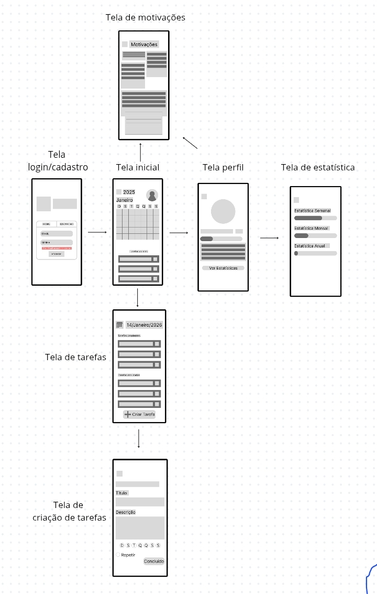
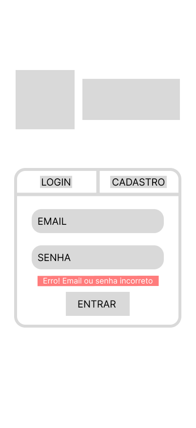
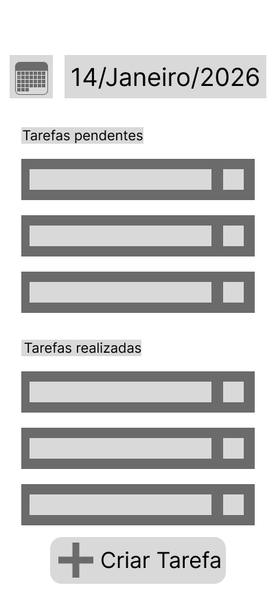
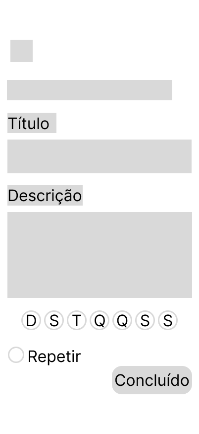
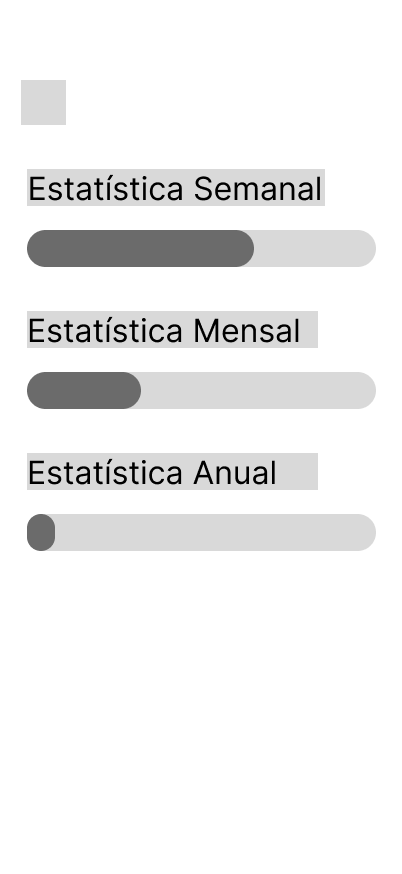
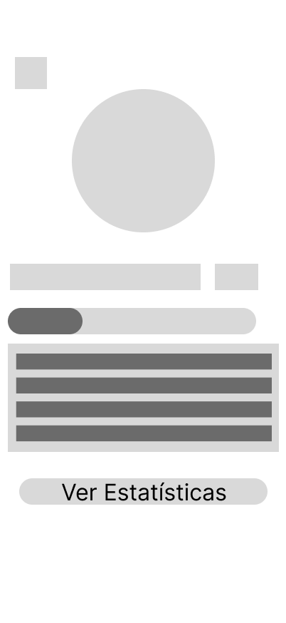
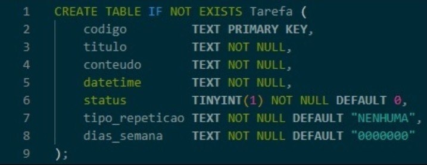

# Lifemind

> Sistema digital voltado para organização pessoal, bem-estar mental e produtividade diária.

---

# 1. Identificação do Projeto

## Equipe

- Derick Rodrigues
- Arthur Lívio
- Giorgio Leandro
- Ernandes da Silva Cutrim

## Disciplina

Projeto Integrador

## Professor

Ely

---

# 2. Problema a ser Resolvido

Muitas pessoas enfrentam dificuldades para organizar tarefas diárias, manter hábitos saudáveis e cuidar da saúde mental de forma prática. A falta de planejamento pode gerar estresse, ansiedade, procrastinação e baixa produtividade.

---

# 3. Objetivo do Projeto

Desenvolver um sistema web/mobile chamado Life Mind, capaz de auxiliar usuários na organização da rotina, gerenciamento de tarefas, acompanhamento de hábitos e incentivo ao bem-estar mental por meio de ferramentas simples e intuitivas.

---

# 4. Público-Alvo

- Estudantes  
- Trabalhadores  
- Pessoas com rotina agitada  
- Usuários que desejam melhorar produtividade  
- Pessoas interessadas em bem-estar mental  
- Instituições  

---

# 5. Tecnologias Utilizadas

| Área | Tecnologia |
|------|------------|
| Front-end | HTML / CSS / JavaScript |
| Back-end | Flask |
| Banco de Dados | MySQL |
| Prototipação | Figma |
| Gestão | Trello |

---

# 6. Requisitos do Sistema

## Atores

- Usuário  
- Funcionários / Desenvolvedores do App  

## Interfaces

### Tela de Login

- Cadastro com e-mail e senha  
- Login com e-mail e senha  

### Tela Inicial

- Resumo do dia  
- Lista de tarefas pendentes  
- Botão para adicionar nova tarefa  

### Tela de Tarefas

- Listagem de tarefas  
- Adicionar tarefa  
- Editar tarefa  
- Excluir tarefa  
- Marcar como concluída  
- Ganho de pontos ao concluir tarefas  

### Tela de Motivação

- Frases motivacionais  
- Dicas de produtividade  
- Salvar mensagens favoritas  
- Curtir mensagens  
- Compartilhar mensagens  
- Criar mensagens positivas próprias  
- Perguntas reflexivas para o usuário  

### Tela de Perfil

- Nível do usuário  
- Estatísticas gerais  
- Evolução no sistema  
- Metas alcançadas  

## Regras de Negócio

- Apenas usuários cadastrados podem acessar funcionalidades privadas.  
- Cada tarefa concluída gera pontos ao usuário.  
- O usuário sobe de nível conforme a pontuação.  
- O sistema deve exibir progresso diário, semanal e anual.  
- Usuários podem editar ou excluir apenas suas próprias tarefas.  

## Backlog

| ID | Item | Prioridade | Status |
|----|------|------------|--------|
| 1 | Criar tela de login | Alta | Em andamento |
| 2 | Criar cadastro de usuário | Alta | Em andamento |
| 3 | Criar função de adicionar tarefa | Alta | Pendente |
| 4 | Listar tarefas na tela | Média | Pendente |
| 5 | Marcar tarefa como concluída | Alta | Pendente |
| 6 | Sistema de metas e nível | Média | Pendente |
| 7 | Tela de motivação | Média | Pendente |
| 8 | Mostrar progresso | Média | Pendente |

## Histórias de Usuário

- Como usuário, quero me cadastrar com e-mail e senha para acessar o aplicativo.  
- Como usuário, quero fazer login para visualizar minhas tarefas e progresso.  
- Como usuário, quero adicionar tarefas para organizar meu dia.  
- Como usuário, quero editar tarefas para atualizar informações.  
- Como usuário, quero marcar tarefas como concluídas para acompanhar meu progresso.  
- Como usuário, quero excluir tarefas desnecessárias.  
- Como usuário, quero ganhar pontos ao concluir tarefas para me sentir motivado.  
- Como usuário, quero subir de nível para visualizar minha evolução.  
- Como usuário, quero visualizar frases motivacionais para manter o foco.  
- Como usuário, quero salvar mensagens favoritas para acessar depois.  
- Como usuário, quero criar minhas próprias mensagens positivas.  
- Como usuário, quero visualizar estatísticas diárias, semanais e anuais.  

---

# 7. Modelagem do Sistema

## Diagrama de Casos de Uso

## Fluxo de Telas

## Arquitetura

## Modelo Entidade-Relacionamento

## Diagrama de Classes

> Caso ainda não exista, justificar ausência.

---
# 8. Protótipos

## Login / Cadastro

## Tela do Dia

## Tela de Agenda

## Tela de Criação da Tarefa

## Tela de Motivação

## Tela de Estatísticas

## Tela do Perfil

---

# 9. Planejamento do Projeto

## Cronograma

| Etapa | Período |
|------|---------|
| Levantamento de requisitos | xx/xx a xx/xx |
| Protótipos | xx/xx a xx/xx |
| Implementação | xx/xx a xx/xx |
| Testes | xx/xx a xx/xx |

## Sprints

| Sprint | Entregas |
|-------|----------|
| Sprint 1 | Login + Cadastro + Banco |
| Sprint 2 | Dashboard + Tarefas |
| Sprint 3 | Relatórios + Motivação |

## Gestão das Tarefas

## Histórico de Entregas

- Entrega 1: documentação inicial  
- Entrega 2: protótipos  
- Entrega 3: implementação parcial  

---

# 10. Banco de Dados

## Estrutura

Arquivos disponíveis:

- `database/ddl.sql`
- `database/dml.sql`
- `database/schema.sql`
- `database/seeds.sql`

## Modelo Visual

## Observações

O banco armazenará usuários, tarefas, níveis, metas, mensagens motivacionais e estatísticas.

---

# 11. Implementação

## Backend

API para autenticação, cadastro, gerenciamento de tarefas, pontuação e estatísticas.

## Frontend

Interfaces responsivas para login, dashboard, tarefas, motivação e perfil.

## Funcionalidades Concluídas

- Login  
- Cadastro  
- Consulta de tarefas  

## Funcionalidades em Desenvolvimento

- Relatórios  
- Painel administrativo  
- Sistema de níveis  
- Estatísticas completas  

---

# 12. Evidências do Projeto

## Sistema Rodando

## Tela Login Real

## Dashboard Implementado

## Banco Funcionando

## API Testada

## Demonstração

`docs/apresentacao/demo.mp4`

---

# 13. Itens Ainda Não Produzidos

## Diagrama de Classes

Ainda não elaborado, pois a modelagem orientada a objetos está em andamento.  
Previsão: Sprint 2.

## Front-end Completo

Interfaces finais ainda em desenvolvimento.

## Versão PC

Versão de computador será desenvolvida durante a versão mobile na próxima etapa.

---

# 14. JUSTIFICATIVA A AUSENCIA DE CERTOS DADOS:

Acabamos não auxiliando muito bem o compromisso com o trabalho, então não fizemos algo muito além nesta etapa do que foi apresentado anteriormente, que também está presente em releases desse repositorio (protótipos, histórias de usuário,etc...).

Também como outras avaliações acabaram atrapalhando nosso foco entre si.

No entanto, iremos entregar na próxima sprint tudo o que falta.

